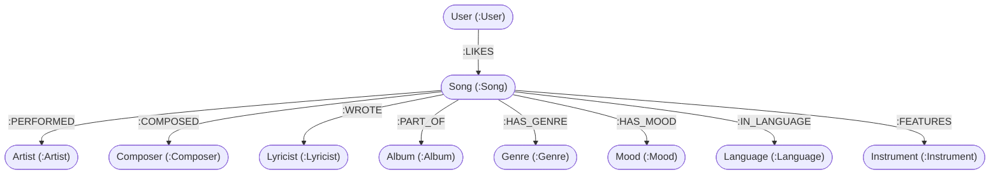

# 🎵 SonicMesh Studio — Music Knowledge Graph & Recommendation Engine

> **WEXA AI — Take-Home Assignment: Build a Graph Database Application**  
> **Candidate**: Dinesh Gurusamy  
> **Repository**: [https://github.com/dinesh-gurusamy/sonicmesh-app](https://github.com/dinesh-gurusamy/sonicmesh-app)  
> **Assignment Specification & Credentials**: [Google Documentation Link](https://docs.google.com/document/d/1mbHQsn-oXqDk4-uxhnldfJBHx1gHEHYEnLwWRl0EqYk/edit?tab=t.0)  
> **Database Layer**: [CognoDB Cloud](https://console.cognodb.com) (openCypher / Neo4j Bolt Driver)  
> **Tech Stack**: SvelteKit 2, TypeScript, Svelte 5 Runes, Tailwind CSS  

---

## 📌 Executive Summary & Application Overview

**SonicMesh Studio** is a full-stack, graph-native web application designed to solve complex data relationship discovery in the music domain. It models the intricate, multi-dimensional connections between songs, performers, composers, lyricists, albums, genres, moods, languages, and featured instruments.

Instead of relying on flat relational tables or opaque black-box machine learning models, **SonicMesh** leverages **CognoDB** over the openCypher protocol to execute multi-hop path traversals. This provides **explainable recommendations** (showing the exact relationship path why a track is suggested) and computes **shortest connection paths** between any two creators or songs in real time.

---

## ❓ Why a Graph Database? (Relational vs. Graph Comparison)

Relational (SQL) databases organize data into rigid tables connected by foreign keys and join tables. In a music recommendation system, SQL encounters critical architectural bottlenecks:

### 1. Relational Bottleneck (JOIN Explosion)
A query such as *"Recommend songs for User X based on shared performers, composers, genres, and moods from tracks they liked"* in SQL requires joining 8+ tables (`users`, `user_likes`, `songs`, `song_artists`, `artists`, `song_composers`, `composers`, `song_genres`, `genres`, `song_moods`, `moods`). In SQL databases, multi-table `JOIN` operations incur exponential $O(N^k)$ performance degradation as the dataset grows.

### 2. Variable-Length Path Traversals
Finding *"How is Song A connected to Artist B through shared collaborators within 5 degrees of separation?"* requires recursive Common Table Expressions (CTEs) or nested subqueries in SQL, which are computationally prohibitive and difficult to maintain.

### 3. The Graph Advantage with CognoDB & openCypher
In **CognoDB**, relationships are first-class primitives stored as direct memory pointers:
- **Direct Edge Traversal ($O(1)$ per hop)**: Navigating from `(:Song)` $\rightarrow$ `:PERFORMED` $\rightarrow$ `(:Artist)` $\rightarrow$ `:PERFORMED` $\rightarrow$ `(:Song)` follows native index-free adjacency pointers in constant time.
- **Native Shortest Path Calculation**: `shortestPath((a)-[*..5]-(b))` evaluates multi-hop relationship chains across the graph network in milliseconds.
- **Path Explainability**: Graph path patterns inherently explain recommendations (e.g., `Vaseegara` $\rightarrow$ `:COMPOSED` $\rightarrow$ `Harris Jayaraj` $\rightarrow$ `Munbe Vaa (+20 Pts)`).

---

## 📐 Graph Data Model

The graph dataset models entities as **labeled nodes** linked by **typed, directional relationships**:



### Node Schema & Properties

| Node Label | Primary ID | Key Properties |
| :--- | :--- | :--- |
| **`Song`** | `id` | `title`, `releaseYear`, `durationSeconds`, `popularity`, `coverImage`, `isLiked` |
| **`Artist`** | `id` | `name`, `country`, `image` |
| **`Composer`** | `id` | `name`, `country`, `image` |
| **`Lyricist`** | `id` | `name`, `country` |
| **`Album`** | `id` | `title`, `releaseYear`, `coverImage` |
| **`Genre`** | `id` | `name` |
| **`Mood`** | `id` | `name` |
| **`Language`** | `id` | `name` |
| **`Instrument`** | `id` | `name`, `image` |
| **`User`** | `id` | `name` |

---

## 🔑 Environment Secrets (`.env`) & Security

All database connection parameters are stored in the root `.env` file and accessed securely via `$env/static/private` in SvelteKit server modules ([cognodb.ts](file:///d:/sonicmesh-app/sonicmesh-app/src/lib/server/cognodb.ts)). Secrets are never exposed to client-side code or committed to public version control.

> 📄 **Assignment & Environment Credentials Doc**:  
> Refer to the attached [Google Documentation Link](https://docs.google.com/document/d/1mbHQsn-oXqDk4-uxhnldfJBHx1gHEHYEnLwWRl0EqYk/edit?tab=t.0) for additional setup details and credentials configuration.

### `.env` File Template

```env
# CognoDB Cloud Instance Connection Details
COGNODB_URI="bolt+s://<instance-id>.databases.cognodb.cloud"
COGNODB_USER="cognodb"
COGNODB_PASSWORD="<your-instance-password>"
```

### What Each Variable Is Used For:
1. **`COGNODB_URI`**: The secure Bolt protocol URI (`bolt+s://`) provided by your CognoDB Cloud Console instance.
2. **`COGNODB_USER`**: Database user name (default: `cognodb`).
3. **`COGNODB_PASSWORD`**: Secret password generated when creating the CognoDB database instance.

---

## 🚀 Setup & Local Installation

### Step 1: Provision a Free CognoDB Cloud Instance
1. Go to [https://console.cognodb.com/signup](https://console.cognodb.com/signup) and create a free account (no credit card required).
2. Create a free `c0` instance in your preferred region (provisions in under a minute).
3. Copy your Connection URI (`bolt+s://<instance-id>.databases.cognodb.cloud`) and generated password.

### Step 2: Clone & Configure Environment
```bash
git clone https://github.com/dinesh-gurusamy/sonicmesh-app.git
cd sonicmesh-app
```
Create a `.env` file in the root directory:
```env
COGNODB_URI="bolt+s://<your-instance-id>.databases.cognodb.cloud"
COGNODB_USER="cognodb"
COGNODB_PASSWORD="<your-generated-password>"
```

### Step 3: Install Dependencies
```bash
npm install
```

### Step 4: Seed Database with Music Graph Data
Execute the seed script to automatically populate your CognoDB database with realistic music tracks, singers, composers, albums, genres, moods, and relationships:
```bash
npm run seed
```

### Step 5: Start Development Server
```bash
npm run dev
```
Open [http://localhost:5173](http://localhost:5173) in your browser.

---

## 🔍 Key Cypher Queries Explained

All queries use **parameterized Cypher inputs** via the official `neo4j-driver` package to prevent injection attacks and optimize query plan execution caching.

### 1. Multi-Hop Explainable Recommendations Query
Traverses 2-hop graph paths connecting liked tracks to candidate songs via shared creators, genres, and moods:

```cypher
MATCH (u:User {id: $userId})-[l:LIKES]->(s1:Song)
MATCH (s1)-[:PERFORMED|COMPOSED|HAS_GENRE|HAS_MOOD|IN_LANGUAGE]-(entity)-(s2:Song)
WHERE NOT (u)-[:LIKES]->(s2) AND s1 <> s2
WITH s2, count(DISTINCT entity) as sharedScore, 
     collect(DISTINCT {
       likedTitle: s1.title, 
       connectorType: head(labels(entity)), 
       connectorName: coalesce(entity.title, entity.name)
     }) as pathLinks
RETURN s2.id as id, s2.title as title, s2.releaseYear as releaseYear, 
       s2.durationSeconds as durationSeconds, s2.popularity as popularity, 
       s2.coverImage as coverImage, sharedScore, pathLinks
ORDER BY sharedScore DESC, s2.popularity DESC
LIMIT 10
```

### 2. Shortest-Path Connection Query
Calculates the shortest relationship chain between any two entities up to 5 hops out:

```cypher
MATCH (start {name: $startQuery}), (end {name: $endQuery})
MATCH p = shortestPath((start)-[*..5]-(end))
RETURN [n in nodes(p) | {
    id: n.id, 
    label: head(labels(n)), 
    name: coalesce(n.name, n.title), 
    image: coalesce(n.image, n.coverImage)
}] as nodes,
[r in relationships(p) | type(r)] as relationships
```

### 3. Parameterized Song Insertion & Relationship MERGE
Merges new track metadata into graph nodes while maintaining strict identity uniqueness:

```cypher
CREATE (s:Song {
    id: $songId, title: $title, releaseYear: toInteger($releaseYear), 
    durationSeconds: toInteger($durationSeconds), popularity: 85
})
MERGE (a:Artist {name: $artistName}) ON CREATE SET a.id = $artistId
MERGE (c:Composer {name: $composerName}) ON CREATE SET c.id = $composerId
MERGE (a)-[:PERFORMED]->(s)
MERGE (c)-[:COMPOSED]->(s)
```

---

## 🎨 Features & Application Highlights

1. **Smart Recommendations (`/recommendations`)**:
   - Calculates personalized match scores based on user likes.
   - Renders interactive **`GRAPH PATH EXECUTION TRACE`** flow badges (`[Vaseegara] ➔ [:COMPOSED] ➔ [Harris Jayaraj] ➔ [Munbe Vaa (+20 Pts)]`).

2. **Liked Connections Visualizer (`/liked-connections`)**:
   - Renders an interactive visual graph mesh mapping saved tracks to performers, composers, and albums.

3. **Shortest Connection Path Finder (`/connect`)**:
   - Interactive pathfinder calculating relationship hops between any two artists or songs in the database.

4. **Global Autocomplete Search (`SearchAutocomplete.svelte`)**:
   - Real-time search autocomplete querying songs, singers, and composers with clean categorizations.

5. **Track Insertion Console (`/add-song`)**:
   - Interactive form executing parameterized Cypher `MERGE` statements linking performers, composers, genre, mood, and instruments.

6. **Graceful Offline & Unreachable Error Handling**:
   - Detects connection drops (`ECONNRESET`, offline state) and displays user-friendly fallback messaging with retry actions.

---

## 🧪 Verification & Type Check

To verify TypeScript types and Svelte component syntax across the codebase:

```bash
npm run check
```
*(Result: **0 errors, 0 warnings**)*

---

## 📄 License & Author

- **Author**: Dinesh Gurusamy  
- **Assignment**: Wexa AI Take-Home Assignment  
- **Submission Email**: `hr@wexa.ai`
