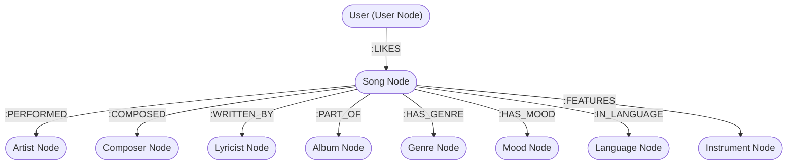

# SonicMesh — Interactive Music Discovery Engine

> **WEXA AI Take-Home Assessment Project**  
> **Candidate**: Dinesh G  
> **Position**: Software Engineer (Full-Stack / Web Developer)  
> **Database Layer**: CognoDB Cloud (openCypher / Neo4j Driver)  
> **Application Tech Stack**: SvelteKit, TypeScript, Tailwind CSS  

---

## 🌟 Executive Overview

**SonicMesh** is a graph database application built to explore complex, multi-dimensional relationships within the music industry. It models how tracks, performers, composers, lyricists, albums, genres, moods, languages, and instruments are interconnected.

Instead of flat relational tables, **SonicMesh** utilizes **CognoDB** to enable multi-hop Cypher traversals—allowing users to discover explainable song recommendations and calculate shortest relationship paths connecting any two artists or songs in real time.

---

## ❓ Why a Graph Database?

Relational SQL databases store data in isolated tables linked by foreign keys and join tables. In a music application:

1. **Relational Bottleneck (JOIN Hell)**:
   A query asking *"Find songs recommended for user X based on artists, composers, genres, and moods of songs they liked"* requires joining 7 to 9 tables (`users`, `user_likes`, `songs`, `song_artists`, `artists`, `song_composers`, `composers`, `song_genres`, `genres`). In SQL, multi-table JOINs incur severe runtime performance degradation as data scales.

2. **Variable-Length Path Finding**:
   Calculating *"How is Song A connected to Artist B through shared collaborators within 5 degrees of separation?"* is practically impossible or extremely inefficient in relational SQL without expensive recursive Common Table Expressions (CTEs).

3. **The Graph Advantage**:
   With **CognoDB** and **openCypher**, relationships are first-class entities. 
   - **Pattern Matching**: Traversing from a `Song` node through `:PERFORMED` to an `Artist` node and onto another `Song` node is a direct pointer traversal \(O(1)\) per hop.
   - **Shortest Path Engine**: `shortestPath((a)-[*..5]-(b))` computes multi-hop relationship chains across the graph in milliseconds.
   - **Explainability**: Graph traversal paths explicitly state *why* a song was recommended (e.g. `Connected via Artist A.R. Rahman ➔ Composer ➔ Shared Genre`).

---

## 📐 Graph Data Model

The graph dataset consists of **labeled nodes** connected by **typed, directional relationships**:



### Node Schema & Properties

| Label | Primary Key | Key Properties |
| :--- | :--- | :--- |
| **`Song`** | `id` | `title`, `releaseYear`, `durationSeconds`, `popularity`, `coverImage`, `likeCount` |
| **`Artist`** | `id` | `name`, `country`, `image` |
| **`Composer`** | `id` | `name`, `image` |
| **`Lyricist`** | `id` | `name` |
| **`Album`** | `id` | `title`, `releaseYear`, `coverImage` |
| **`Genre`** | `id` | `name` |
| **`Mood`** | `id` | `name` |
| **`Language`** | `id` | `name` |
| **`Instrument`** | `id` | `name`, `image` |
| **`User`** | `id` | `name` |

---

## 🔍 Key Cypher Queries Explained

All queries interact with CognoDB via the official `neo4j-driver` using **parameterized inputs** to prevent Cypher injection vulnerabilities.

### 1. Explainable Multi-Hop Recommendations Query
Calculates candidate recommendation tracks based on shared artist, composer, genre, mood, and language relationships from the user's liked songs:

```cypher
MATCH (u:User {id: $userId})-[l:LIKES]->(s1:Song)
MATCH (s1)-[:PERFORMED|COMPOSED|HAS_GENRE|HAS_MOOD|IN_LANGUAGE]-(entity)-(s2:Song)
WHERE NOT (u)-[:LIKES]->(s2) AND s1 <> s2
WITH s2, count(DISTINCT entity) as weightScore
OPTIONAL MATCH (s2)-[:PERFORMED]->(a:Artist)
OPTIONAL MATCH (s2)-[:COMPOSED]->(c:Composer)
OPTIONAL MATCH (s2)-[:HAS_GENRE]->(g:Genre)
OPTIONAL MATCH (s2)-[:HAS_MOOD]->(m:Mood)
OPTIONAL MATCH (s2)-[:IN_LANGUAGE]->(lang:Language)
RETURN s2.id as id, s2.title as title, s2.releaseYear as releaseYear, 
       s2.durationSeconds as durationSeconds, s2.popularity as popularity, 
       s2.coverImage as coverImage, weightScore,
       collect(DISTINCT a.name) as artists,
       collect(DISTINCT c.name) as composers,
       collect(DISTINCT g.name) as genres,
       collect(DISTINCT m.name) as moods,
       head(collect(DISTINCT lang.name)) as language
ORDER BY weightScore DESC, s2.popularity DESC
LIMIT 10
```

### 2. Shortest-Path Multi-Hop Connection Finder
Finds the shortest relationship chain between any two entities (songs, artists, composers) up to 5 hops:

```cypher
MATCH (start {name: $startQuery}), (end {name: $endQuery})
MATCH p = shortestPath((start)-[*..5]-(end))
RETURN [n in nodes(p) | {
    id: n.id, 
    label: head(labels(n)), 
    name: coalesce(n.name, n.title), 
    image: coalesce(n.image, n.coverImage)
}] as nodes,
[r in relationships(p) | type(r)] as relationships
```

### 3. Parameterized Node Creation & Relationship Merging
Adds a new song to the catalog and links it to creators using Cypher `MERGE`:

```cypher
MERGE (s:Song {id: $songId})
ON CREATE SET s.title = $title, s.releaseYear = $releaseYear, s.durationSeconds = $durationSeconds, s.popularity = 85
MERGE (a:Artist {name: $artistName}) ON CREATE SET a.id = "ART-" + apoc.create.uuid()
MERGE (c:Composer {name: $composerName}) ON CREATE SET c.id = "CMP-" + apoc.create.uuid()
MERGE (s)-[:PERFORMED]->(a)
MERGE (s)-[:COMPOSED]->(c)
```

---

## 🛠️ Project Architecture & Engineering Highlights

- **Non-Blocking Streaming UI**: SvelteKit client-side API routes (`/api/stats`, `/api/songs`, `/api/recommendations`, `/api/connect`) paired with Svelte `{#await ...}` promises render page layouts **instantly** without server-side blocking.
- **Loading Skeletons & UX**: Shimmer placeholder components ([LoadingSkeleton.svelte](file:///d:/impact-graph/impactgraph-app/src/lib/components/LoadingSkeleton.svelte)) display during network fetches.
- **Resilient Connection Pooling**: [cognodb.ts](file:///d:/impact-graph/impactgraph-app/src/lib/server/cognodb.ts) configures driver connection pooling (`maxConnectionPoolSize: 10`, `connectionTimeout: 5000`) and graceful error handling for network interruptions (`ECONNRESET`).
- **Strict Environment Security**: Secrets (`COGNODB_URI`, `COGNODB_USER`, `COGNODB_PASSWORD`) are loaded safely using `$env/static/private` and are never committed to the repository.

---

## 🚀 Setup & Local Installation

### 1. Prerequisites
- Node.js (v18 or higher)
- A free **CognoDB Cloud** instance (from [console.cognodb.com](https://console.cognodb.com))

### 2. Environment Configuration
Create a `.env` file in the root directory:

```env
COGNODB_URI="bolt+s://<your-instance-id>.databases.cognodb.com"
COGNODB_USER="cognodb"
COGNODB_PASSWORD="<your-generated-password>"
```

### 3. Install Dependencies
```bash
npm install
```

### 4. Seed CognoDB Database
Populate the database with songs, artists, composers, albums, and high-quality image URLs:

```bash
npm run seed
```

### 5. Run Local Development Server
```bash
npm run dev
```
Open `http://localhost:5173` in your browser.

---

## 🧪 Verification & Type Check

To run TypeScript verification across all routes and components:

```bash
npm run check
```
*(Verification result: 0 errors, 0 warnings)*

---
 
